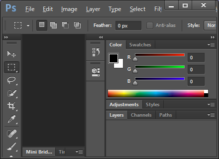
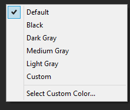
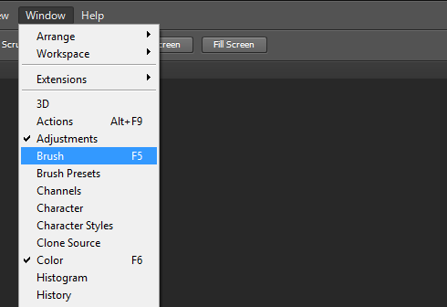
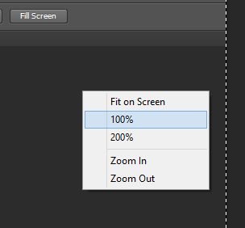

# Menus in the title bar
Menus in the title bar on Windows is a standard affordance for most Adobe apps.  This is made possible with the OWL framework for most apps.  The approach taken by the OWL team (architect for this feature was Eric George) was to draw the menubar and all of the UI affordances but the actual menu popup is handled by the system.  There were a number of intricate levers and pulleys involved in hooking this up correctly (mostly by a Windows hook) that made this a challenge.  I worked fairly close with Eric to work out quite a number of issues with the invocation and I think we finally got it working.  

One of the things that we agreed to as part of the acceptance criteria for the Dark UI theming on Windows was that we would enforce a strict size requirement to avoid making the app difficult to use and drawing of the titlebar in such a way that it was unreadable.  If we don't menus, titles and other controls get clipped and truncated such that it becomes a jumbled mess.  

Our current behavior for Brackets is to let the system deal with the menubar so, when the app is sized too narrow, additional rows are added to the menubar to ensure all menus are visible and accessible.  CS Apps do not behave in this manner.  Here is a Photoshop CS6 with a enough of a narrow width that menus get clipped.

This makes accessibility a challenge because pressing the ALT key and releasing it moves focus to the menubar and selects the first menu item (File).  Using the arrow keys you can move selection to the next menu item. When this is done without a popup visible, you can select something that isn't in view and lose your context.  Pressing Enter, Down Arrow or Spacebar will activate the popup from this mode which appears out of nowhere for the hidden menu items.

Another issue that Photoshop suffers from is inconsistent menu themes.  Context menus appear the way menus appear in standard Windows apps. As you can see this context menu from Photoshop has a system style checkmark:

Top-level menus have the stock Windows XP appearance.  I'm not sure if this was done intentionally by handling WM_DRAWITEM or if there is an application flag that invokes legacy menu drawing code for those menus on newer versions of the OS.  I am testing this with Windows 8 but Windows 7 and Vista have a similar stock menu appearance.

Here is a Photoshop CS6 top-level menu with a checkmark:

As you can see the checkmark is vastly different from that of the context menu in Photoshop.  Also note the selection color is different as well. As you can see the color of the selected item is different in the context menu (below) than the top-level menu (above).

Like I said, I'm not sure if this was a technical limitation or an oversight in the OWL / Drover framework code.

# Suggested Approach

As previously stated in the Architectural proposal, this is new territory. To minimize the risk, I have put this near the bottom of the priority list because of my lack of familiarity with it and to get the other more important things done that I know how to do and can get traction on very quickly.  

As such and to mitigate the technical challenges, we may elect to punt on moving the menubar to the title bar. Thus we should have an alternate proposal to just draw the menubar and menus dark.  This work is still challenging but not overwhelming and far more accessible.  

We can make that decision when we get towards the middle of the development cycle for this story but we should get the pieces in place should we decide on an alternate approach.

